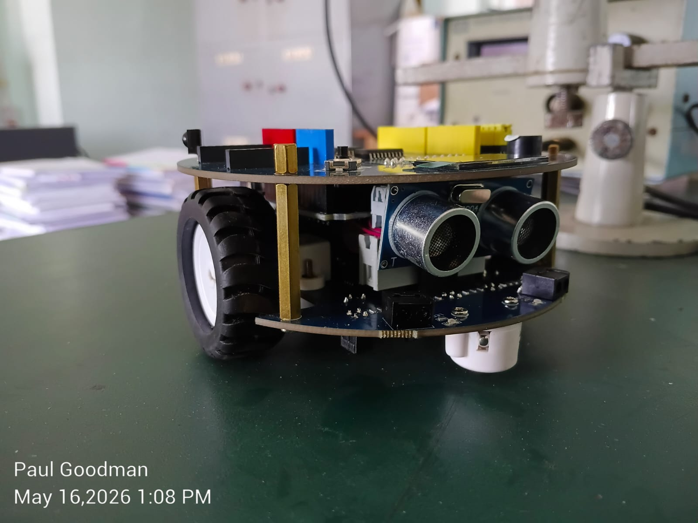

# AlphaBot V2-Ar 

<div align="center">



**A Complete Arduino-Based Robotics Learning Platform**


[Features](#features) • [Getting Started](#getting-started) • [Documentation](#documentation) • [Tasks](#tasks) • [References](#references)

</div>

---

## Overview

The **AlphaBot V2-Ar** is a complete robotics development platform specifically designed for Arduino-based projects. It offers a robust foundation for learning embedded systems and robotics programming, with all necessary components for creating intelligent robotic applications while maintaining beginner-friendly accessibility.

This repository contains comprehensive code examples, learning materials, and challenge tasks for mastering the AlphaBot V2-Ar platform.

### Key Specifications

| Component | Specification |
|-----------|---------------|
| **Microcontroller** | ATmega328P (Arduino Uno/Nano compatible) |
| **Motor Driver** | TB6612FNG Dual H-Bridge (high efficiency, compact) |
| **Motors** | N20 Micro Gear Motors (1:30 reduction, 6V/600RPM) |
| **Wheels** | Rubber wheels (Ø 42mm, width 19mm) |
| **Power** | 14500 Li-ion Battery (2x required) |
| **Charging** | 5V USB Type-C |
| **Line Sensors** | TCRT5000/ITR20001 (3-5 adjustable sensors) |
| **Distance Sensor** | HC-SR04 Ultrasonic (2cm - 4m range) |
| **Display** | 0.96" OLED SSD1306 (128x64 pixels) |
| **RGB LEDs** | WS2812B Addressable (NeoPixel) |
| **Communication** | HC-05 Bluetooth Module, IR Receiver |
| **Audio** | Onboard Buzzer |
| **Input** | Analog Joystick with button |
| **I/O Expansion** | PC8574 I/O Expander (SPI), TLC1543 10-bit ADC |

---

## Features

### Hardware Capabilities
- Dual motor control with speed and direction adjustment
- Line tracking with 3-5 reflective sensors and PID control
- Obstacle avoidance using ultrasonic rangefinder
- Wireless control via Bluetooth (HC-05)
- Infrared remote control compatibility
- Addressable RGB LED feedback
- OLED display for data visualization
- Analog joystick for manual control
- Audio feedback with programmable buzzer

### Software Features
- 15 sensor learning activities for individual component testing
- 10 integration challenges for multi-sensor coordination
- Progressive complexity from beginner to expert level
- Reusable functions with modular code architecture
- Real-time monitoring through serial and OLED feedback
- Well-documented code with comments and usage guides

---

## Getting Started

### Prerequisites

**Hardware Required:**
- AlphaBot V2-Ar Complete Kit
- Arduino IDE (v1.8.0 or later)
- USB Cable (Type-A to Micro-B or USB-C)
- 2x 14500 Li-ion Batteries
- Battery Charger

**Software Dependencies:**
```
Arduino Built-in Libraries:
  - Wire (I2C)
  - SPI
  - Servo
  
External Libraries (Install via Arduino Library Manager):
  - Adafruit SSD1306
  - Adafruit GFX Library
  - NeoPixel/Adafruit NeoPixel
  - IRremote
  - TRSensors
```

### Installation Steps

1. **Clone the Repository**
   ```bash
   git clone https://github.com/rajdeep13-coder/AlphaBot-2.git
   cd AlphaBot-2
   ```

2. **Install Arduino IDE**
   - Download from: https://www.arduino.cc/en/software
   - Install for your operating system

3. **Install Required Libraries**
   - Open Arduino IDE → Sketch → Include Library → Manage Libraries
   - Search and install:
     - `Adafruit SSD1306`
     - `Adafruit GFX Library`
     - `Adafruit NeoPixel`
     - `IRremote`
     - `TRSensors`

4. **Configure Board Settings**
   - Tools → Board → Arduino Uno (or Nano)
   - Tools → Port → Select your COM port
   - Tools → Programmer → AVRISP mkII

5. **Upload First Program**
   - Open `01_motor_control.ino`
   - Click Upload (Ctrl+U)
   - Monitor output via Serial Monitor (115200 baud)

---

## Repository Structure

```
AlphaBot-2/
├── README.md                          # This file
├── TASKS.md                          # Complete tasks roadmap
├── REFERENCES.md                     # Internet resources & links
│
├── 01_Sensors/                       # Phase 1: Individual sensor testing
│   ├── 01_motor_control.ino
│   ├── 02_square_motion.ino
│   ├── 03_circular_motion.ino
│   ├── 04_rgb_sequential.ino
│   ├── 05_rgb_paired.ino
│   ├── 06_rgb_motion_sync.ino
│   ├── 07_buzzer_beep.ino
│   ├── 08_buzzer_melody.ino
│   ├── 09_joystick_control.ino
│   ├── 10_oled_text.ino
│   ├── 11_oled_shapes.ino
│   ├── 12_oled_stickman.ino
│   ├── 13_ir_receiver.ino
│   ├── 14_ultrasonic_distance.ino
│   └── 15_line_sensor.ino
│
├── 02_Integration_Tasks/             # Phase 2: Multi-sensor challenges
│   ├── T01_joystick_motor.ino
│   ├── T02_joystick_oled.ino
│   ├── T03_ir_rgb_control.ino
│   ├── T04_ir_rgb_motor.ino
│   ├── T05_ultrasonic_rgb_motor.ino
│   ├── T06_edge_detection.ino
│   ├── T07_line_tracking.ino
│   ├── T08_line_rgb_brightness.ino
│   ├── T09_right_line_following.ino
│   └── T10_maze_solver.ino
│
├── 03_Advanced_Projects/             # Phase 3: Optional projects
│   ├── obstacle_avoidance.ino
│   ├── bluetooth_remote.ino
│   ├── autonomous_patrol.ino
│   └── data_logger.ino
│
├── 04_Libraries/                     # Custom libraries and utilities
│   ├── AlphaBot2_Motor.h
│   ├── AlphaBot2_Sensor.h
│   ├── AlphaBot2_Display.h
│   └── AlphaBot2_Utilities.h
│
├── 05_Configuration/                 # Pin mappings and settings
│   ├── pins.h                        # Pin definitions
│   ├── config.h                      # Global configuration
│   └── calibration.ino               # Sensor calibration tools
│
├── 06_Documentation/                 # Detailed documentation
│   ├── SENSOR_GUIDE.md              # Sensor specifications
│   ├── CIRCUIT_DIAGRAM.md           # Wiring information
│   ├── TROUBLESHOOTING.md           # Common issues & solutions
│   ├── LIBRARY_REFERENCE.md         # Custom library API
│   └── pin_mapping.csv              # Pin allocation table
│
└── 07_Examples/                      # Additional example projects
    ├── color_mixing.ino
    ├── distance_alarm.ino
    ├── motor_calibration.ino
    └── sensor_test_suite.ino
```

---

## Learning Path

### Phase 1: Sensor Fundamentals (Weeks 1-3)
Learn individual components in isolation

| Component | Learn | Activities | Tasks |
|-----------|-------|-----------|-------|
| **Motors** | Included | Activity 1.1-1.3 | - |
| **RGB LED** | Included | Activity 2.1-2.3 | - |
| **Buzzer** | Included | Activity 3.1-3.2 | - |
| **Joystick** | Included | Activity 4.1 | Task 1, 2 |
| **OLED** | Included | Activity 5.1-5.5 | Task 2 |
| **IR Receiver** | Included | Activity 6.1 | Task 3 |
| **Ultrasonic** | Included | Activity 7.1 | Task 5 |
| **Line Sensor** | Included | Activity 8.1 | Task 6, 7 |

### Phase 2: Integration & Challenges (Weeks 4-8)
Combine sensors for complex behaviors

- **Week 4**: Tasks 1-4 (Input + Output integration)
- **Week 5**: Tasks 5-6 (Sensor fusion basics)
- **Week 6**: Tasks 7-8 (Advanced algorithms)
- **Week 7**: Task 9 (Complex navigation)
- **Week 8**: Task 10 (Full system integration)

### Phase 3: Advanced Projects (Weeks 9+)
Implement real-world applications

---

## Documentation

### Quick Start Guides
- [**Getting Started**](#getting-started) - Initial setup
- [**Pin Mapping**](06_Documentation/pin_mapping.csv) - Hardware connections
- [**Troubleshooting**](06_Documentation/TROUBLESHOOTING.md) - Common issues

### Detailed References
- [**Sensor Guide**](06_Documentation/SENSOR_GUIDE.md) - Technical specifications
- [**Circuit Diagram**](06_Documentation/CIRCUIT_DIAGRAM.md) - Wiring diagrams
- [**Library API**](06_Documentation/LIBRARY_REFERENCE.md) - Function documentation
- [**Tasks Roadmap**](TASKS.md) - Complete learning objectives

### External Resources
- [**Official Documentation**](https://shyamjohnson.github.io/alphabotv2.github.io/) - AlphaBot V2-Ar official docs
- [**Waveshare Wiki**](https://www.waveshare.com/wiki/AlphaBot2-Ar) - Hardware specifications
- [**All References**](REFERENCES.md) - Comprehensive internet resources

---

## Tasks and Challenges

This repository includes **25 progressively complex tasks**:

### Phase 1: Basic Sensor Testing (15 Activities)
Each sensor is tested individually with demonstration code and serial output verification.

### Phase 2: Integration Challenges (10 Tasks)
- **Task 1-2**: Input device integration
- **Task 3-4**: Wireless control and feedback
- **Task 5-6**: Distance sensing and line detection
- **Task 7-9**: Advanced line tracking algorithms
- **Task 10**: Autonomous maze solving

### Phase 3: Advanced Projects (4+ Projects)
- Autonomous obstacle avoidance
- Bluetooth-enabled remote control
- Autonomous patrol systems
- Data logging and analysis

**For detailed task list, see [TASKS.md](TASKS.md)**

---

## Pin Mapping Reference

```
MOTOR CONTROL:
  - Motor A (Left) PWM:  Pin 5
  - Motor A (Left) Dir:  Pin 4
  - Motor B (Right) PWM: Pin 6
  - Motor B (Right) Dir: Pin 7

SENSORS:
  - Line Sensors:        A0-A2 (analog)
  - Ultrasonic TRIG:     Pin 8
  - Ultrasonic ECHO:     Pin 9
  - IR Receiver:         Pin 11

DISPLAY & OUTPUT:
  - OLED SDA:            A4 (I2C)
  - OLED SCL:            A5 (I2C)
  - RGB LED:             Pin 12
  - Buzzer:              Pin 10

INPUT:
  - Joystick X:          A6
  - Joystick Y:          A7
  - Joystick Button:     Pin 2 (Interrupt)
```

*For detailed mapping, see [pin_mapping.csv](06_Documentation/pin_mapping.csv)*

---

## Building Custom Libraries

Each component has reusable library functions:

```cpp
// Motor Control
void moveForward(int speed);
void moveBackward(int speed);
void turnLeft(int speed);
void turnRight(int speed);

// Display
void displayText(String text, int x, int y);
void drawShape(int type, int x, int y, int size);

// Sensors
int readDistance();
int* readLineArray();
String readJoystick();

// Utilities
void calibrateSensors();
void serialPrint(String label, int value);
void setMotorSpeed(int left, int right);
```

---

## Testing and Validation

### Sensor Calibration
Each activity includes calibration steps:
```bash
1. Upload calibration sketch
2. Open Serial Monitor (115200 baud)
3. Follow on-screen instructions
4. Record calibration values
5. Update config.h with values
```

### Verification Checklist
- [ ] All motors respond to PWM commands
- [ ] RGB LEDs display the intended colors
- [ ] OLED output is clear and readable
- [ ] Joystick input is accurate across the full range
- [ ] IR receiver decodes remote signals correctly
- [ ] Ultrasonic sensor measures within ±5 cm accuracy
- [ ] Line sensors are calibrated for white and black distinction
- [ ] Buzzer produces consistent tones

---

## Code Quality Standards

All code in this repository follows these standards:

### Documentation
```cpp
/**
 * @brief Function description
 * @param param1 Description of param1
 * @return Description of return value
 * @note Any important notes
 */
void functionName(int param1) {
    // Implementation with comments
}
```

### Naming Conventions
- `camelCase` for variables and functions
- `UPPER_CASE` for constants and macros
- Descriptive names (no single letters except loop counters)

### Best Practices
- Use `#define` for pin numbers and constants
- Include comments for non-obvious logic
- Check function return values for errors
- Use serial debugging where appropriate
- Test on hardware regularly

---

## Troubleshooting

### Common Issues

**Motor not moving?**
- Check battery voltage (should be ~7.4V for two 3.7V cells)
- Verify pin connections match `config.h`
- Test with SimpleMotorTest sketch
- Check motor for mechanical blockage

**OLED not displaying?**
- Verify I2C address (0x3C or 0x3D)
- Check SDA/SCL pin connections
- Install Adafruit libraries (exact versions)
- Try I2C Scanner sketch to detect address

**Line tracking unstable?**
- Calibrate sensors in actual lighting
- Adjust PID parameters
- Ensure white tape is 15cm wide
- Check for uneven motor speeds

**IR Remote not working?**
- Verify IR receiver connections
- Check remote battery
- Decode IR codes with test sketch
- Ensure no IR noise from environment

For more troubleshooting, see [TROUBLESHOOTING.md](06_Documentation/TROUBLESHOOTING.md)

---

## External References

This project builds upon extensive community documentation and references.

### Official Resources
- **Waveshare Official Wiki**: https://www.waveshare.com/wiki/AlphaBot2-Ar
- **Official Documentation**: https://shyamjohnson.github.io/alphabotv2.github.io/
- **User Manual PDF**: https://www.mouser.com/pdfdocs/Alphabot2-user-manual-en.pdf

### Hardware Vendors
- **Waveshare**: https://www.waveshare.com/alphabot2-ar.htm
- **Seeed Studio**: https://www.seeedstudio.com/AlphaBot2-robot-building-kit-for-Arduino
- **Cytron**: https://www.cytron.io/p-alphabot2-robot-building-kit-for-arduino
- **Fabtolab (India)**: https://www.fabtolab.com/alphabot2-arduino
- **Amazon**: https://www.amazon.com/search?k=AlphaBot2

### Community Projects
- **Alphabot2-Arduino**: https://github.com/WouterW007/Alphabot2-arduino
- **AlphaBot2-Arduino Examples**: https://github.com/myduino/AlphaBot2-Arduino
- **GitHub Topics**: https://github.com/topics/alphabot

### Educational Content
- **Open Electronics Article**: https://www.open-electronics.org/alphabot2-the-opensource-robot/
- **Arduino Official Guide**: https://www.arduino.cc/en/Guide
- **YouTube Tutorials**: Search "AlphaBot2 Arduino" on YouTube

**For complete reference list, see [REFERENCES.md](REFERENCES.md)**

---

## License

This project is licensed under the **MIT License** - see the [LICENSE](LICENSE) file for details.

---

## Contributing

We welcome contributions! Please see [CONTRIBUTING.md](CONTRIBUTING.md) for guidelines.

### How to Contribute
1. Fork the repository
2. Create a feature branch (`git checkout -b feature/YourFeature`)
3. Commit your changes (`git commit -m 'Add YourFeature'`)
4. Push to the branch (`git push origin feature/YourFeature`)
5. Open a Pull Request

### Areas for Contribution
- [ ] Additional challenge tasks
- [ ] Advanced project examples
- [ ] Library improvements
- [ ] Documentation enhancements
- [ ] Video tutorials
- [ ] Circuit diagrams
- [ ] Troubleshooting guides
- [ ] Community examples

---

## Tips and Best Practices

### For Beginners
1. Start with Phase 1 activities in order
2. Use Serial Monitor for debugging
3. Test on hardware immediately after coding
4. Don't skip calibration steps
5. Keep a lab notebook of observations

### For Optimization
1. Profile code with timing measurements
2. Reduce unnecessary Serial output in final code
3. Optimize loop frequency for your application
4. Use interrupts for time-sensitive tasks
5. Consider power consumption in battery operation

### Hardware Care
1. Always disconnect battery before programming
2. Don't apply reverse voltage
3. Avoid moisture and dust
4. Keep motors clean from debris
5. Check wheel alignment regularly

---

## Support and Questions

- **Documentation Issues**: Open GitHub Issue
- **Code Questions**: Check Troubleshooting guide
- **Hardware Problems**: Consult Waveshare Wiki
- **General Support**: Arduino Community Forums

---

## Acknowledgments

This project is built upon the excellent work of:
- **Waveshare** - AlphaBot2 Hardware Design
- **Shyam Johnson** - AlphaBot V2-Ar Documentation
- **Arduino Community** - Open source tools and libraries
- **Contributors** - All who have shared code and knowledge

---

## Project Status

| Component | Status | Notes |
|-----------|--------|-------|
| Motor Control | Complete | Tested and working |
| RGB LED | Complete | All animations working |
| OLED Display | Complete | Text and graphics ready |
| Line Tracking | In progress | PID tuning ongoing |
| Bluetooth | In progress | Basic functionality working |
| Maze Solver | In progress | Algorithm under development |
| Documentation | In progress | 80% complete |

---

## Getting Help

1. **Check the Docs** - Most answers are in README or TASKS.md
2. **Search Issues** - Your problem likely has a solution
3. **Try Troubleshooting** - See TROUBLESHOOTING.md
4. **Test Individually** - Isolate the problem to one component
5. **Use Serial Monitor** - Print debug information

---

**AlphaBot V2-Ar Project Documentation**

*Last Updated: 2026*  
*Repository: https://github.com/rajdeep13-coder/AlphaBot-2*
